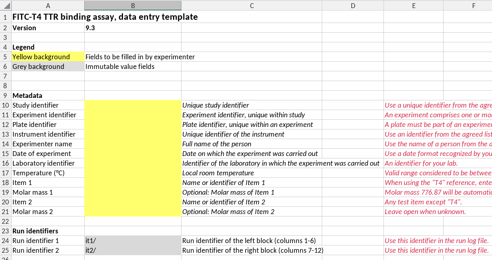
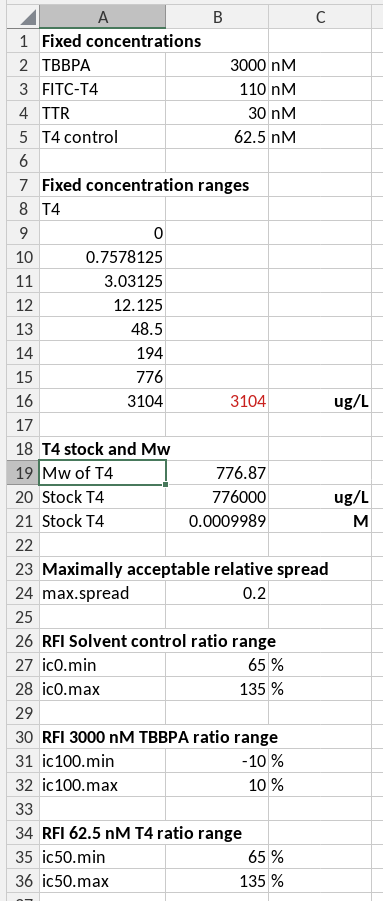
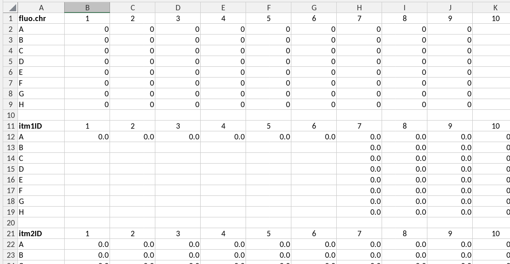

# writing_templates_and_data_guides

## Introduction

Spreadsheets are widely used in biochemical laboratories for both
recording and analyzing experiments. When experiments become routine,
spreadsheet templates are often created to streamline workflows and
ensure consistency.

The goal of the **excelDataGuide** package is to enable the use of Excel
spreadsheets alongside scripting environments as effective data analysis
tools. While scripting languages offer more flexibility and
power—especially for analyzing large datasets across multiple
workbooks—the spreadsheet remains the **primary source of all data**.

This **“single-source-of-truth”** approach ensures that both
spreadsheet-based and script-based analyses rely on the same underlying
data and parameters. This includes:

- **Metadata**
- **Experimental parameters** (e.g., acceptance criteria,
  concentrations)
- **Measured data**

Parameters such as acceptance criteria are typically defined by standard
operating procedures (SOPs) and fixed in the spreadsheet templates.
Other values, such as experimental measurements or fitted parameters,
vary per experiment and are entered by the user.

In some cases, it may be beneficial for the script to also use
**calculated data** from the spreadsheet—especially when those
calculations are automatically triggered upon user input. This decision
depends on the specific analysis needs and the reliability of
spreadsheet-based computations.

## Structuring a template

To provide a link between the data structures of programming languages
and those in a spreadsheet we consider the following four types of data
structures in a template:

- **keyvalue**: a key-value pair, where the key is a variable name and
  the value is the value of that variable. The key and value are placed
  in horizontally adjacent cells (columns). The key, or its translated
  short name (see below) is to be used as the parameter name in the
  scripts and should conform to variable naming rules for the scripting
  language used. The key is found in the left-most cell of a cell range.
  The value can be a single value (one cell) or a vector of values
  (multiple cells).
- **cells**: occasionally it may be more convenient to read values from
  single cells and provide the keys (names) of the corresponding
  variables in the data guide. These data will be stored as key-value
  pairs, but in contrast to the **keyvalue** data type where a variable
  name is provided in the template the data guide must provide a
  variable name.
- **table**: tabular data where columns represent variables and rows
  represent items in which these variables are assessed. Column names
  are written in the first row and are used as variable names.
- **platedata**: data are registered in the same row-column format as
  the microplate in which the experiment was performed. The first row
  contains the variable name in its left-most cell, and is followed by
  (integer) column names. Every subsequent row contains the row name (in
  capital letters) followed by the values for each well. Both variable
  name and data are read by the script. The column and row names are
  ignored. Therefore, the first row and column in the range could also
  be empty, except for the variable name. Plate data are stored as
  tables in which, apart from the variables provided in the template two
  additional columns are added, namely row and column, corresponding to
  the row and column in a microplate.

Below is an example of the front page of a template (of the fitc-t4 TTR
assay), illustrating a number of ideas and concepts that we discuss
below.



First page of a template

### A template has a version number

Unique template version numbers are a way to prevent misunderstandings
between users and are also needed here to check whether a data guide is
compatible with the template version.

**Version numbering rules**. We follow the R-package version rules. A
version number has the structure major.minor or major.minor.patch, where
major, minor and patch are each integer values. A version consisting of
only a major number is invalid, but will be interpreted as having a
minor version 0, *i.e.* a version “2” will be interpreted as “2.0”.

In practice this means that the format of the cell in which the version
number is recorded should be *text*, and not *general* or *number*

**A template name is optional**. Preferably, a template also has a name.
Note that the example in the figure above doesn’t have a name.

**Checking compatibilty of template versions and a guide version**. We
use template version numbers to check compatibility with a guide. In
principle the same guide can be used for multiple versions of a template
as long as the locations and names of variables indexed in the guide did
not change. This is the case when, for example, only explanatory texts
or calculations or data validity checks have changed in the template.
When checking version compatibility we assume that a guide is compatible
with a consecutive range of template versions between a minimal and a
maximal version number.

### All cells are protected except those for data entry

Data entry cells have a distinct background color, here “marker yellow”.
All other cells have protected status to prevent users from
inadvertently changing them.

### Include comments

Refer to the SOP+ version

### Built-in data entry checks

The validity of data entered by the users should be checked by validity
checks, especially when misunderstandings are likely to happen. The
validity checking capability by excel is limited. In cases where the
data structure can not be properly described by a validity rule we add a
comment next to the cell in which the data is entered.

### A single source of parameters



The parameters as key-value pairs

Parameters needed for calculations, for example for acceptance criteria
of measurements are best entered on a separate sheet, and referred to by
absolute references in calculations. In the case of the example we have
a separate hidden sheet called \*\_parameters\* for this purpose. The
information in this sheet is indexed in the data guide, and therefore
available to R-scripts as well.

### Use of hidden worksheets for data transfer



A hidden sheet with links to plate-formatted data

## What else?

The keyvalue format will be mostly used for metadata and parameters. All
keyvalue will be aggregated in a single named list called “keyvalue”.

The platedata format will be used for measured data and data concerning
concentrations in the plate wells. All ranges will be aggregated in a
single data frame with reported variables as column names, including the
column names “row” and “col”, corresponding to the row and column names
of the plate.

## Constructing a guide

Every spreadsheet template should be accompanied by a data guide, and
index registering the location of different data structures in the
template. This guide is a yaml file, a human editable and computer
readable file format.

Below is an example of the first rows of a data guide:

``` yaml
guide.version: '1.0'
template.name: competition
template.min.version: '9.3'
template.max.version: ~
plate.format: 96
locations:
  - sheet: description
    type: cells
    varname: .template
    translate: false
    variables:
      - name: version
        cell: B2
  - sheet: description
    type: keyvalue
    translate: true
    atomicclass:
      - character
      - character
      - character
      - character
      - character
      - date
      - character
      - numeric
      - character
      - numeric
      - character
      - numeric
      - character
      - character
    varname: metadata
    ranges:
      - A10:B21
      - A24:B25
# remainder not shown
```

A guide must contain the following elements:

### Required elements

- guide.version: the version of the guide
- template.name: a name for the template
- template.min.version: The minimal version of the template for which
  the guide can be used with the guide
- template.max.version: The maximal version of the template for which
  the guide can be used.
- locations: the object containing the data locations
- translations: the object containing the translations of variable
  names. Translations can be used both from extended (‘long’) format to
  short format and from short to long format. Two functions are provided
  by the package to perform these translations *vice versa*.

### Conditionally required element:

- plate.format the format of the microplates used for the experiments.
  This must be either of ‘24’, ‘48’, ‘96’, or ‘384’. This is required
  when a **platedata** element occurs in the **locations**. This plate
  format is used to check the correctness of dimensions of the ranges of
  **platedata** elements.

The elements in **locations** indicate where data are to be found,
whereas the translation part contains translations between long and
short names for variables. Short names are used as variable names in the
scripts, whereas long names may be used in the spreadsheet, in
particular when these are visible to the user. In that case the names
should be translated before using them in the script. Reverse
translations may be used by the script in the output document.

## Locations

### Required elements

- sheet: the name of the sheet in which the data are to be found.
- type: the format of the data in the range.
- translate: (*true*, *false*) whether the variable names should be
  translated before use in the script.
- varname: the name of the variable in which the data will be available
  in the script.
- ranges: an array of ranges in which the data are to be found.

### Optional element

- atomicclass: the class of the data in the ranges, Can have values
  “character”, “numeric”, “integer”, “logical” or “date”., It can.be
  either a singleton or an array of class of the same length as the
  number of ranges. If a singleton then by default all values are
  converted to character. If an atomicclass is given then values are
  coerced. Coercion is performed by the functions `as.character`,
  `as.numeric`, `as.integer`, `as.logical`, respectively, or in case of
  a date, by a function that produces a Date object.

### Checking against the excelDataGuide json schema

Correctness of the structure and syntax of a YAML file like a data guide
can be checked against a JSON schema (See
[json-schema-everywhere](https://json-schema-everywhere.github.io/yaml)).
We provide a JSON schema called excelguide_schema.json in the folder
data-raw. We use the [Polyglottal JSON Schema
Validator](https://www.npmjs.com/package/pajv) to validate guides
against this schema.
