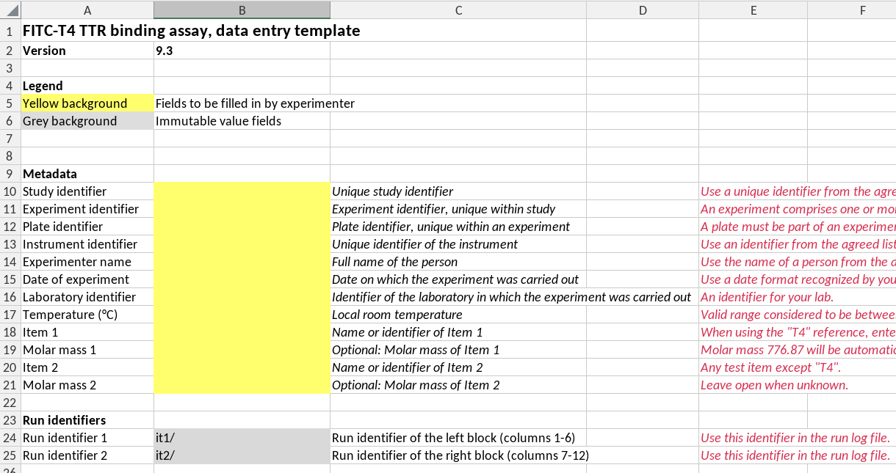
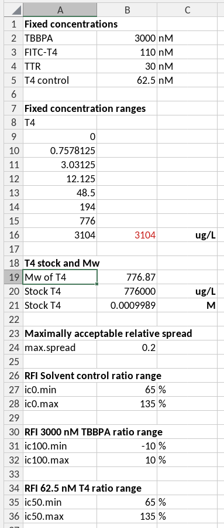
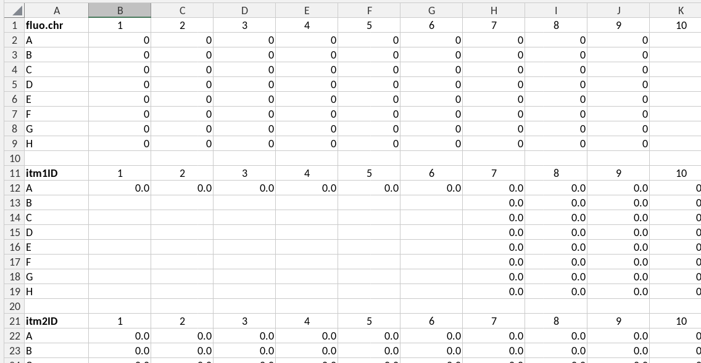

```{r, include = FALSE}
knitr::opts_chunk$set(
  collapse = TRUE,
  comment = "#>"
)
```

```{r setup}
library(excelDataGuide)
```

## Introduction

Spreadsheets are a widely used tool in the biochemical laboratory, both to 
record and to analyze experiments. When such experiments become a routine we 
often create spreadsheet templates to save time and to structure our work. When
analyzing a lot of these experiments switching to a scripting language like R or
Python for analysis will become useful. Also in these cases the spreadsheet template
is a useful way to structure the recording of experimental data and metadata.

The goal of the excelDataGuide package is to be able to use both Excel-compliant 
spreadsheets and scripts as data analysis tools. Clearly, a scripting language 
has more potential when it comes to analyzing large data sets, consisting of 
multiple notebooks.

Importantly, **the source of all data is the spreadsheet.** This concerns 
metadata, parameters like acceptance criteria, concentrations and measured data.
This guarantees that calculations in the spreadsheet and in the scripts are all 
based on the same underlying data.

Concerning calculated data it may or may not be useful to let the spreadsheet be
the source of such data for the script as well. This may be particularly useful 
when it concerns calculations that are carried out automatically upon entry
of data by the user.

Part of these data, like acceptance criteria, is determined in the SOP and fixed
in the spreadsheet template, whereas other data may vary per experiment and is
entered by the user. For example, when a user performs parameter fitting, it may
be useful to compare the fitted parameters to those obtained in another 
programming environment.

## Writing a template

Below is an example of the front page of a template (of the fitc-t4 TTR assay),
illustrating a number of ideas and concepts that we discuss below.

{width=100%}

### A template has a version number

#### Version numbering rules

We follow the R-package version rules. A version number has the structure
**<kbd>major.minor</kbd>** or **<kbd>major.minor.patch</kbd>**, where
<kbd>major</kbd>, <kbd>minor</kbd> and <kbd>patch</kbd> are each 
integer values. A version consisting of only a major number is invalid, but 
will be interpreted as having a minor version <kbd>0</kbd>, *i.e.* a version
"<kbd>2</kbd>" will be interpreted as "<kbd>2.0</kbd>".

In practice this means that the format of the cell in which the version number
is recorded should be *text*, and not *general* or *number*

#### A template name is optional 

Preferably, a template also has a name. Note that the example above doesn't have
a name.

#### Checking compatibilty of template versions and a guide version

We use template version numbers to check compatibility with a guide. That is 
because the same guide could in principle be used for multiple versions of a 
template, for example because only explanatory texts or calculations have 
changed but not locations of data. When checking version compatibility we 
assume that a guide is compatible with a consecutive range of template versions
between a minimal and a maximal version number.

### All cells are protected except those for data entry

Data entry cells have a distinct background color

### Include comments

Refer to the SOP+ version 

### Built-in data entry checks

### A single source of parameters

{width=35%}

### Use of hidden worksheets for data transfer

{width=100%}

## What else?

To facilitate automatic reading from the spreadsheet by scripts data must be 
in either of these four formats:

- **keyvalue** format. Here, the key and value are placed in horizontally 
adjacent cells (columns). The key is to be used as the parameter name in the
scripts and should conform to variable naming rules for the scripting language
used. The key is found in the left-most cell of a cell range. The value can be a
single value (one cell) or a vector of values (multiple cells).
- **platedata** format. Here the data are registered in the same row-column 
format as the microplate in which the experiment was performed. The first row
contains the variable name in its left-most cell, and is followed by (integer) 
column names. Every subsequent row contains the row name (in capital letters) 
followed by the values for each well. Both variable name and data are read by 
the script. The column and row names are ignored. Therefore, the first row 
and column in the range could also be empty, except for the variable name. 
- **table** format. This is the format for tabular data where columns represent
variables and rows represent items in which these variables are assessed. Column
names are written in the first row.
- **cells** format. Occasionally it may be more convenient to read values from 
single cells and provide the keys (names) of the corresponding variables in the
data guide.
 

The keyvalue format will be mostly used for metadata and parameters. All keyvalue 
will be aggregated in a single named list caled "keyvalue".

The platedata format will be used for measured data and data concerning 
concentrations in the plate wells. All ranges will be aggregated in a single 
data frame with reported variables as column names, including the column names 
"row" and "col", corresponding to the row and column names of the plate.

Clearly, to make sure that calculations made in the spreadsheet and in the 
script use the same values, the spreadsheet should use parameter values *etc.*
by the (preferably absolute) cell-reference mechanism, whereas the script should
use these values by reference to their variable names.

Every spreadsheet template should be accompanied by a guide indicating the 
sheets and ranges in which keyvalue and platedata formatted data are to be found
in the filled out template. This guide is a yaml file.

This guide is structured as follows:

```{yaml}
guide.version: '1.0'
template.name: competition
template.min.version: '9.3'
template.max.version: ~
plate.format: 96
locations:
  - sheet: description
    type: cells
    varname: .template
    translate: false
    variables:
      - name: version
        cell: B2
  - sheet: description
    type: keyvalue
    translate: true
    varname: metadata
    ranges:
      - A10:B14
      - A16:B16
      - A18:B18
      - A20:B20
      - A24:B25
  - sheet: concentration response
    type: table
    translate: false
    varname: userresults
    atomicclass: numeric
    ranges:
      - J3:M5
  - sheet: BGfluo
    type: cells
    varname: userchecks
    translate: false
    atomicclass: numeric
    variables:
      - name: spread.itm1
        cell: G6
      - name: spread.itm2
        cell: G33
translations:
  - long: Version
    short: template.version
  - long: Template Name
    short: template.name
  - long: Study identifier
    short: studyID
  - long: Experiment identifier
    short: exptID
# remainder not shown
```

A guide must contain the following elements:

- **template.name**: the name of the data reporting template.
- **template.version**: the version of the data reporting template.
- **plate.format**: the format of the microplate used in the experiment (valid values are 24, 48, 96 and 384).
- **locations**: a list of locations in the spreadsheet where data are to be found. Each location is a list of elements.
- **translations**: a list of translations between long and short names for variables.

The location data indicate where data are to be found, whereas the translation 
part contains translations between long and short names for variables. Short 
names are used as variable names in the scripts, whereas long names may be used 
in the spreadsheet, in particular when these are visible to the user. In that 
case the names should be translated before using them in the script. Reverse 
translations may be used by the script in the output document.

Required elements in a location are:

- **sheet**: the name of the sheet in which the data are to be found.
- **type**: the format of the data in the range.
- **translate**: (*true*, *false*) whether the variable names should be translated before use in the script.
- **varname**: the name of the variable in which the data will be available in the script.
- **ranges**: the ranges in which the data are to be found.

Furthermore, an optional element **atomicclass** can be provided which can have
values "character", "numeric", "integer" or "logical". By default, values are
converted to character, but if desired otherwise as indicated by the 
**atomicclass** element then values are coerces. Note that coercion is performed
by the functions `as.character`, `as.numeric`, `as.integer` and `as.logical` 
respectively.

The version should correspond to that reported in the template itself, 
otherwise the file or the template is invalid. The user of this package 
should take care of this check.


## Writing a guide

### Required elements

-  <kbd>guide.version</kbd>: the version of the guide
-  <kbd>template.name</kbd>: a name for the template
-  <kbd>template.min.version</kbd>: The minimal version of the template for which the guide 
   can be used 
   with the guide
-  <kbd>template.max.version</kbd>: The maximal version of the template for which the guide 
   can be used.
-  <kbd>locations</kbd>: the object containing the data locations
-  <kbd>translations</kbd>: the object containing the translations of variable names. 
   Translations can be used both from extended ('long') format to short format 
   and from short to long format. Two functions are provided by the package to
   perform these translations *vice versa*.

### Conditionally required element:

-  <kbd>plate.format</kbd> the format of the microplates used for the experiments. This 
   must be either of '24', '48', '96', or '384'. This is required when a 
   **platedata** element occurs in the **locations**. This plate format is used
   to check the correctness of dimensions of the ranges of **platedata** 
   elements.

### Checking against the excelDataGuide json schema

Correctness of the structure of a YAML file like a data guide can be 
checked against a JSON schema (See [json-schema-everywhere](https://json-schema-everywhere.github.io/yaml)). 
We provide a JSON schema called <kbd>excelguide_schema.json</kbd> in the folder
<kbd>data-raw</kbd>. We use the [Polyglottal JSON Schema Validator](https://www.npmjs.com/package/pajv) 
to validate guides against this schema.
