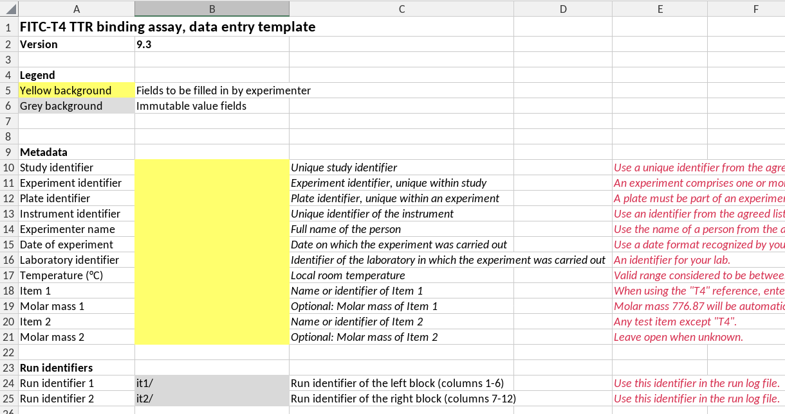
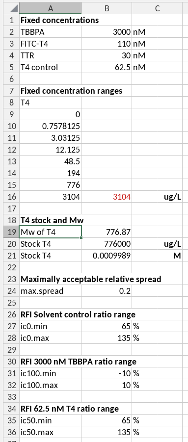
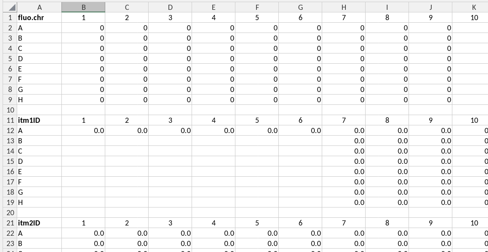

```{r, include = FALSE}
knitr::opts_chunk$set(
  collapse = TRUE,
  comment = "#>",
  echo = FALSE
)
```

```{r setup}
library(excelDataGuide)
```

## Introduction

Spreadsheets are used in biochemical laboratories for both recording and
analyzing experiments. In case of routine experiments, spreadsheet templates
are often used to streamline workflows and ensure consistency.

The goal of the **excelDataGuide** package is to enable the use of Excel
spreadsheets alongside scripting environments as effective data analysis tools.
While scripting languages offer more flexibility and power — especially for
analyzing large datasets across multiple workbooks — the spreadsheet is the
*primary source of all data*.

This *single source of truth* approach ensures that both spreadsheet-based
and script-based analyses rely on the same underlying data and parameters.
This includes:

- **Metadata** (user data, instrument settings, *etc*.)
- **Experimental parameters** (acceptance criteria, standard concentrations, *etc*.)
- **Experimental data** (raw measurements, concentrations *etc*.)

Parameters such as acceptance criteria and standard concentration are typically defined by standard
operating procedures (SOPs) and can be stored in single cells or ranges of cells in a
spreadsheet. They can be referred to by abolute referencing or by using named cells or named ranges.
Other values, such as raw measurements or fitted parameters, vary per
experiment and are entered by the user.

Sometimes it may be beneficial for the script to also use *calculated data* 
from the spreadsheet — especially when those calculations are
automatically triggered upon user input and these results should be compared to
results from a script-based analysis.

## Spreadsheet templates and data guides

The solution that we propose here is to use a data guide, a file that describes
in a concise manner where data can be found in a template. Furthermore, it
also describes the expected type of data (*e.g*, numeric or text or date) so that
the data can be read in the correct format. The data guide is a *yaml* file. We
chose this format because it has a simple structure, and can be easily read and
edited in a text editor.

## Constructing a spreadsheet template

To provide a link between the data structures of programming languages and
those in a spreadsheet we consider the following four types of data structures
in a template:

- **keyvalue**: a key-value pair, where the key is a variable name and the value
  is the value of that variable. The key and value are placed in horizontally
  adjacent cells (columns). The key, or its translated short name (see below)
  is to be used as the parameter name in the scripts and should conform to
  variable naming rules for the scripting language used. The key is found in
  the left-most cell of a cell range. The value can be a single value (one cell)
  or a vector of values (multiple cells).
- **cells**: occasionally it may be more convenient to read values from single
  cells and provide the keys (names) of the corresponding variables in the data
  guide. These data will be stored as key-value pairs, but in contrast to the
  **keyvalue** data type where a variable name is provided in the template
  the data guide must provide a variable name.
- **table**: tabular data where columns represent variables and rows represent
  items in which these variables are assessed. Column names are written in the
  first row and are used as variable names.
- **platedata**: data are registered in the same row-column format as the
  microplate in which the experiment was performed. The first row contains the
  variable name in its left-most cell, and is followed by (integer) column names.
  Every subsequent row contains the row name (in capital letters) followed by the
  values for each well. Both variable name and data are read by the script. The
  column and row names are ignored. Therefore, the first row and column in the
  range could also be empty, except for the variable name. Plate data are stored
  as tables in which, apart from the variables provided in the template two
  additional columns are added, namely row and column, corresponding to the row
  and column in a microplate.

Below is an example of the front page of a template (of the fitc-t4 TTR assay),
illustrating a number of ideas and concepts that we discuss below.

```{r, out.width="100%", fig.cap="First page of a template"}

```

### A template must have a version number

Templates usually evolve over periods of usage and testing. To prevent misunderstandings a template version should have a unique template version number.
We also needed them to check whether a data guide is compatible with the template version.

**Version numbering rules**. We follow the R-package version rules. A version
number has the structure `major.minor` or `major.minor.patch`,
where `major`, `minor` and `patch` are each
integer values. A version consisting of only a major number is invalid, but
will be interpreted as having a minor version `0`, *i.e.* a version
"`2`" will be interpreted as "`2.0`".

In practice this means that the format of the spreadsheet cell in which the version number
is recorded should formally be *text*, and not *general* or *number*. However,
in the Exceldataguide package we do provide functionality to interpret these fields as version
numbers even if the cells in the template have *general* or *number* format.

**Checking compatibilty of template versions and a guide version**. We use
template version numbers to check compatibility with a guide. In principle
the same guide can be used for multiple versions of a template as long as the
locations and names of variables indexed in the guide did not change in new
template versions. This is the case when, for example, only explanatory texts
or calculations or data validity checks have changed in the template. When checking version compatibility we
assume that a guide is compatible with a consecutive range of template versions between a minimal and a maximal version number.

If you design the template carefully you can use the same data guide for several versions of the template. That is, as long as the location of the indexed data does not change, you can use the same data guide for different versions of the template. You can specify the compatible version of the templates in the *data guide*. The package will check compatibility. Clearly, you should use versioned data templates, and  hence, a required field in a template is its version number. 

### A template must have a name
A template must have a name as a way for users to refer to it. Note that the example in the figure above doesn't have a name. TODO: correct this example.

<!--In the guide this field is referred to as `template.name`.-->


<!--In the guide these version numbers are referred to as `template.min.version`
and `template.max.version`.-->

### Protect all cells except those for data entry

Data entry cells have a distinct background color, here "marker yellow". All
other cells have protected status to prevent users from inadvertently changing
them.

### Include comments

Refer to the SOP+ version

### Built-in data entry checks

The validity of data entered by the users should be checked by validity checks,
especially when misunderstandings are likely to happen. The validity checking
capability by excel is limited. In cases where the data structure can not be
properly described by a validity rule we add a comment next to the cell in which
the data is entered.

### A single source of parameters

```{r, out.width="40%", fig.align='center', fig.cap="The parameters as key-value pairs"}

```

Fixed parameters needed for calculations, for example for acceptance criteria or standard concentrations of
(parameters that are usually described in a SOP) are best entered on a separate sheet, and referred to by absolute
references or by named references in calculations. This mechanism prevents you from having to search through the 
entire template for formulas using these parameters if you need to change them, and it prevents you from accidentally 
using wrong values in calculations. In the case of the example we have a separate hidden sheet called **_parameters** 
for this purpose. This prevents users from accidentally modifying them, and keeps the template clean and organized. 
The information in this sheet can be indexed in the data guide, and will then be available to script-based analyses as well.

### Use of hidden worksheets for data transfer

```{r, out.width="100%", fig.align='center', fig.cap="A hidden sheet with links to plate-formatted data"}

```

### Missing values in spreadsheets

TODO

### What else?

The keyvalue format will be mostly used for metadata and parameters. All keyvalue
will be aggregated in a single named list called "keyvalue".

The platedata format will be used for measured data and data concerning
concentrations in the plate wells. All ranges will be aggregated in a single
data frame with reported variables as column names, including the column names
"row" and "col", corresponding to the row and column names of the plate.

## Constructing a guide

Every spreadsheet template should be accompanied by a data guide — a YAML file
that documents where data are located within the template and how they should be
interpreted. This guide serves as the blueprint that tells the `excelDataGuide`
package exactly where to find and how to read your data.

A data guide is a human-editable, computer-readable YAML file. YAML syntax is
simple: use colons (`:`) for key-value pairs, hyphens (`-`) for lists, and
indentation for nesting. This section walks you through constructing a guide
step by step.

### Step 1: Define the header

Every guide begins with five pieces of metadata that describe the template itself:

``` yaml
guide.version: '1.0'
template.name: myassay
template.min.version: '1.0'
template.max.version: '2.0'
plate.format: 96
```

- **`guide.version`** (*required*): The version of the guide itself (not the template).
  Use `major.minor` format, e.g., `'1.0'` or `'2.1'`. This allows you to track
  changes to the guide independently from the template.

- **`template.name`** (*required*): A short, descriptive name for the template
  (e.g., `'myassay'`, `'fluorescence_assay'`). This is used to identify which
  template a guide belongs to and is checked at runtime if you enable template
  name validation.

- **`template.min.version`** (*required*): The minimum template version for which
  this guide is compatible. Use `major.minor` format (e.g., `'1.0'`).

- **`template.max.version`** (*required*, can be null): The maximum template version
  for which this guide is compatible. If there is no upper limit, use `~` (YAML
  null) to indicate "any newer version is OK". For example, `template.max.version: ~`
  means the guide works with all template versions from `template.min.version`
  onwards.

- **`plate.format`** (*conditionally required*): The microplate format used in your
  experiments. Valid values are `24`, `48`, `96`, or `384` (referring to the
  number of wells). This is **required only if your guide includes any
  `platedata` locations** (see below). The guide uses this to validate that
  your platedata ranges have the correct dimensions.

### Step 2: Add your first location — template version cell

The `.template` location is a special, **required** location that records the
template version from a single cell. This allows the package to check at runtime
that the data file was created with a compatible template version.

``` yaml
locations:
  - sheet: description
    type: cells
    varname: .template
    translate: false
    variables:
      - name: version
        cell: B2
```

**What this does:**
- Reads cell `B2` from the sheet named `description`
- Stores its value in a variable called `version` within the `.template` group
- `translate: false` means no translation is applied (the cell value is used as-is)

This location **must be present in every guide**. The package uses the version
value to check compatibility with `template.min.version` and `template.max.version`.

### Step 3: Add metadata as key-value pairs

Metadata such as experimenter names, dates, and study IDs are typically stored as
key-value pairs in your template. One location entry can index multiple ranges.

``` yaml
  - sheet: description
    type: keyvalue
    varname: metadata
    translate: true
    atomicclass:
      - character
      - character
      - date
      - numeric
    ranges:
      - A5:B8
      - A10:B12
```

**What this does:**
- Reads two ranges (`A5:B8` and `A10:B12`) from the `description` sheet
- The left column of each range contains keys (variable names); the right column contains values
- `translate: true` means the keys will be translated from long names (in the
  spreadsheet) to short names (used in your script) using the `translations`
  section defined later
- `atomicclass` is a list of data types, one per key-value pair in order. In this
  example, the first three key-value pairs should be coerced to character, character,
  and date respectively, then numeric for any additional pairs (coercion cycles
  through the list if needed). All values are coerced to character by default if
  `atomicclass` is omitted.

**Combining multiple ranges into one variable:** Multiple ranges are combined into
a single named list (`metadata` in this example). This is convenient when metadata
is scattered across multiple sheets or ranges but logically belongs together.

### Step 4: Add experiment parameters

Parameters that are constant across all experiments (e.g., acceptance criteria,
standard concentrations defined in SOPs) are best stored in a dedicated `_parameters`
sheet. They are indexed like metadata:

``` yaml
  - sheet: _parameters
    type: keyvalue
    varname: parameters
    translate: false
    atomicclass: numeric
    ranges:
      - A2:B5
      - A8:B10
```

Here, all values will be coerced to numeric. Use `translate: false` if your
parameter names are already in the format you want in the script.

### Step 5: Add measured plate data

If your template records plate data (e.g., fluorescence measurements from a 96-well
plate), use the `platedata` type:

``` yaml
  - sheet: _data
    type: platedata
    varname: plate
    translate: false
    atomicclass:
      - character
      - numeric
      - numeric
    ranges:
      - A1:M9
      - A11:M19
```

**What this does:**
- Reads data in plate format (e.g., well positions and measurements)
- Each range is a block of data in the same row-column layout as the physical plate
- Multiple ranges are stacked vertically into a single data frame
- The resulting data frame includes columns `row` and `col` (well positions) plus
  one column per measured variable, each coerced to its corresponding `atomicclass`

In this example, the first three variables will be character, numeric, numeric
respectively. The first range (`A1:M9`) represents rows A–H of the plate (8 rows)
with 12 columns of data.

### Step 6: Add tabular data

Tables with column headers and multiple rows of data are indexed using the `table`
type:

``` yaml
  - sheet: results
    type: table
    varname: userresults
    translate: false
    atomicclass: numeric
    ranges:
      - C3:E10
```

**What this does:**
- Reads a table from range `C3:E10`
- The first row contains column names (variable names)
- All values are coerced to the specified `atomicclass`
- The result is a data frame, not a list

### Step 7: Add single-cell values

Sometimes you need to read isolated values from single cells and give them names
in the guide (rather than relying on names in the spreadsheet):

``` yaml
  - sheet: analysis
    type: cells
    varname: qc_checks
    translate: false
    atomicclass: numeric
    variables:
      - name: spread_well_1
        cell: G6
      - name: spread_well_2
        cell: G33
```

**What this does:**
- Reads individual cells and assigns them names specified in the guide
- `spread_well_1` gets the value from cell `G6`, `spread_well_2` from `G33`
- All values are coerced to numeric
- The result is a named list

This is useful when values are scattered or when the spreadsheet's cell-naming
scheme doesn't align with your script's variable-naming scheme.

### Step 8: Add translations

If your spreadsheet uses long, user-friendly variable names (e.g., "Date of experiment")
but your script prefers short, code-friendly names (e.g., `date`), define a
`translations` section:

``` yaml
translations:
  - long: "Date of experiment"
    short: date
  - long: "Experimenter name"
    short: experimenter
  - long: "Study identifier"
    short: studyID
  - long: "Plate identifier"
    short: plateID
```

**When to use translations:**
- Set `translate: true` in a location to apply these translations to its variable
  names
- Translations are optional; if you don't define any, set `translate: false` in
  all locations
- The package provides `long_to_shortnames()` and `short_to_longnames()` functions
  to convert between formats

### Complete example guide

Below is a complete, working guide for a small fluorescence assay template:

``` yaml
guide.version: '1.0'
template.name: simple_fluorescence
template.min.version: '1.0'
template.max.version: ~
plate.format: 96

locations:
  # Required: template version
  - sheet: description
    type: cells
    varname: .template
    translate: false
    variables:
      - name: version
        cell: B2

  # Metadata: user and experiment information
  - sheet: description
    type: keyvalue
    varname: metadata
    translate: true
    atomicclass:
      - character
      - character
      - date
      - numeric
    ranges:
      - A5:B8

  # Parameters: SOP-defined constants
  - sheet: _parameters
    type: keyvalue
    varname: parameters
    translate: false
    atomicclass: numeric
    ranges:
      - A2:B5

  # Plate data: fluorescence measurements
  - sheet: _data
    type: platedata
    varname: fluorescence
    translate: false
    atomicclass: numeric
    ranges:
      - A1:M9
      - A11:M19

  # Quality control: derived metrics from analysis sheet
  - sheet: analysis
    type: cells
    varname: qc
    translate: false
    atomicclass: numeric
    variables:
      - name: plate_uniformity
        cell: D3
      - name: signal_range
        cell: D4

translations:
  - long: "Experimenter name"
    short: experimenter
  - long: "Date of experiment"
    short: date
  - long: "Temperature (°C)"
    short: temperature
  - long: "Sample concentration (µM)"
    short: concentration
```

### Validation with CUE

Before using your guide in your scripts, validate it against the CUE schema to
catch syntax and structure errors early:

``` bash
# From the data-raw folder where the schema is located:
cd data-raw
./validate_and_sign.sh path/to/your/guide.yml
```

This command will:
1. Check your guide against `excelguide_schema.cue`
2. Abort with a detailed error message if validation fails
3. Embed a SHA256 hash (`cue.verified` field) if validation succeeds

The hash acts as proof that the guide was validated; you can verify it later
with:

``` bash
./verify_guide.sh path/to/your/guide.yml
```

In R, you can also check the hash when loading a guide:

``` r
guide <- read_guide("path/to/guide.yml", verify_hash = TRUE)
```

This will warn if the hash is missing or abort if the hash is invalid.
